# System Design Document

## Project Overview
<!-- Add your project name and description from the hackathon submission -->

### Project Name
[Your Project Name]

### Version
1.0

### Last Updated
February 3, 2026

---

## Table of Contents
1. [Introduction](#introduction)
2. [System Architecture](#system-architecture)
3. [Component Design](#component-design)
4. [Data Design](#data-design)
5. [API Design](#api-design)
6. [ML Model Design](#ml-model-design)
7. [Security Design](#security-design)
8. [Deployment Architecture](#deployment-architecture)
9. [Monitoring and Logging](#monitoring-and-logging)
10. [Disaster Recovery](#disaster-recovery)

---

## 1. Introduction

### 1.1 Purpose
This document describes the technical design and architecture for [Project Name], an AI-powered solution built for the AWS AI for Bharat Hackathon.

### 1.2 Scope
The design covers:
- Overall system architecture
- AWS service integration
- AI/ML model design
- API and interface design
- Security and compliance
- Deployment strategy

### 1.3 Design Goals
- **Scalability**: Handle growing user base and data volume
- **Reliability**: 99.5%+ uptime
- **Performance**: Low latency responses
- **Security**: Enterprise-grade security
- **Cost-Effectiveness**: Optimize AWS costs
- **Maintainability**: Clean, modular architecture

---

## 2. System Architecture

### 2.1 High-Level Architecture

```mermaid
graph TB
    Users["👥 Users/Clients<br/>(Web, Mobile, API)"]
    
    subgraph CDN["CDN & Security Layer"]
        CloudFront["☁️ Amazon CloudFront"]
        WAF["🛡️ AWS WAF"]
    end
    
    subgraph AppLayer["Application Layer"]
        ALB["⚖️ Application Load Balancer<br/>(Multi-AZ)"]
        Frontend["🖥️ Frontend App<br/>(S3 + React)"]
        APIGateway["🚪 API Gateway<br/>(REST/HTTP)"]
    end
    
    subgraph Compute["Compute Layer"]
        LambdaAuth["⚡ Lambda<br/>(Auth)"]
        LambdaBusiness["⚡ Lambda<br/>(Business Logic)"]
        LambdaML["⚡ Lambda<br/>(ML Processing)"]
    end
    
    subgraph Data["Data Layer"]
        Cognito["🔐 Amazon Cognito<br/>(Authentication)"]
        DynamoDB["📊 DynamoDB<br/>(NoSQL)"]
        RDS["🗄️ RDS/Aurora<br/>(SQL)"]
    end
    
    subgraph ML["ML/AI Layer"]
        SageMaker["🤖 SageMaker<br/>Endpoint"]
        S3["📦 Amazon S3<br/>(Data Lake)"]
    end
    
    Users -->|HTTPS| CloudFront
    CloudFront --> WAF
    WAF --> ALB
    ALB --> Frontend
    ALB --> APIGateway
    
    APIGateway --> LambdaAuth
    APIGateway --> LambdaBusiness
    APIGateway --> LambdaML
    
    LambdaAuth --> Cognito
    LambdaBusiness --> DynamoDB
    LambdaBusiness --> RDS
    LambdaML --> SageMaker
    
    SageMaker --> S3
    
    classDef userClass fill:#e1f5ff,stroke:#01579b,stroke-width:2px
    classDef cdnClass fill:#fff3e0,stroke:#e65100,stroke-width:2px
    classDef appClass fill:#f3e5f5,stroke:#4a148c,stroke-width:2px
    classDef computeClass fill:#e8f5e9,stroke:#1b5e20,stroke-width:2px
    classDef dataClass fill:#fce4ec,stroke:#880e4f,stroke-width:2px
    classDef mlClass fill:#e0f2f1,stroke:#004d40,stroke-width:2px
    
    class Users userClass
    class CloudFront,WAF cdnClass
    class ALB,Frontend,APIGateway appClass
    class LambdaAuth,LambdaBusiness,LambdaML computeClass
    class Cognito,DynamoDB,RDS dataClass
    class SageMaker,S3 mlClass
```



### 2.2 Architecture Principles

1. **Microservices Architecture**: Loosely coupled services
2. **Serverless-First**: Use Lambda for compute where possible
3. **Event-Driven**: Asynchronous processing using SNS/SQS
4. **Cloud-Native**: Leverage managed AWS services
5. **Multi-AZ**: High availability across availability zones
6. **API-First**: RESTful APIs for all interactions

### 2.3 Technology Stack

#### Frontend
- **Framework**: React.js 18+
- **State Management**: Redux/Context API
- **UI Library**: Material-UI / Tailwind CSS
- **Language**: TypeScript
- **Hosting**: Amazon S3 + CloudFront

#### Backend
- **Runtime**: AWS Lambda (Node.js 18.x / Python 3.11)
- **API**: Amazon API Gateway
- **Authentication**: Amazon Cognito
- **Language**: Python/Node.js/TypeScript

#### Data Layer
- **NoSQL**: Amazon DynamoDB
- **SQL**: Amazon RDS (PostgreSQL) or Aurora
- **Object Storage**: Amazon S3
- **Caching**: Amazon ElastiCache (Redis)

#### ML/AI
- **Training**: Amazon SageMaker
- **Inference**: SageMaker Endpoints / Lambda
- **NLP**: Amazon Comprehend
- **Generative AI**: Amazon Bedrock (optional)
- **Framework**: TensorFlow/PyTorch/Scikit-learn

#### DevOps
- **IaC**: AWS CDK / CloudFormation
- **CI/CD**: AWS CodePipeline + CodeBuild
- **Monitoring**: Amazon CloudWatch
- **Logging**: CloudWatch Logs
- **Tracing**: AWS X-Ray

---

## 3. Component Design

### 3.1 Frontend Application

#### 3.1.1 Component Structure
```
src/
├── components/
│   ├── common/          # Reusable components
│   ├── features/        # Feature-specific components
│   ├── layout/          # Layout components
│   └── forms/           # Form components
├── pages/               # Page components
├── services/            # API service layer
├── store/               # State management
├── utils/               # Utility functions
├── hooks/               # Custom React hooks
├── types/               # TypeScript types
└── config/              # Configuration files
```

#### 3.1.2 Key Features
- Responsive design with mobile-first approach
- Progressive Web App (PWA) capabilities
- Lazy loading and code splitting
- Multi-language support (i18n)
- Accessibility (WCAG 2.1 AA)

### 3.2 API Gateway Layer

#### 3.2.1 API Structure
```
/api/v1/
├── /auth
│   ├── POST /login
│   ├── POST /register
│   ├── POST /logout
│   └── POST /refresh
├── /users
│   ├── GET /users/{id}
│   ├── PUT /users/{id}
│   └── DELETE /users/{id}
├── /data
│   ├── GET /data
│   ├── POST /data
│   ├── PUT /data/{id}
│   └── DELETE /data/{id}
└── /ml
    ├── POST /predict
    ├── POST /batch-predict
    └── GET /model-info
```

#### 3.2.2 Gateway Configuration
- **Throttling**: 1000 requests/second per user
- **Authentication**: Cognito Authorizer
- **CORS**: Enabled for web clients
- **API Keys**: For third-party integrations
- **Request Validation**: JSON schema validation

### 3.3 Lambda Functions

#### 3.3.1 Function Organization
```
lambdas/
├── auth/
│   ├── login/
│   ├── register/
│   └── verify/
├── data/
│   ├── create/
│   ├── read/
│   ├── update/
│   └── delete/
├── ml/
│   ├── preprocess/
│   ├── inference/
│   └── postprocess/
└── utils/
    └── shared/          # Shared utilities as Lambda Layer
```

#### 3.3.2 Function Configuration
- **Memory**: 512MB - 3008MB (based on workload)
- **Timeout**: 30s - 900s (based on function)
- **Concurrency**: Reserved concurrency for critical functions
- **VPC**: VPC-enabled for database access
- **Layers**: Shared dependencies and utilities

### 3.4 Database Design

See [Section 4: Data Design](#4-data-design) for detailed schema.

---

## 4. Data Design

### 4.1 Database Selection Strategy

| Data Type | Database | Rationale |
|-----------|----------|-----------|
| User profiles, session data | DynamoDB | Fast K-V access, serverless scaling |
| Transactional data | RDS/Aurora | ACID compliance, complex queries |
| ML training data | S3 | Cost-effective large-scale storage |
| Cached results | ElastiCache | Sub-ms latency for frequent reads |
| Time-series logs | CloudWatch Logs | Native AWS integration |

### 4.2 DynamoDB Schema

#### 4.2.1 Users Table
```json
{
  "TableName": "Users",
  "KeySchema": [
    { "AttributeName": "userId", "KeyType": "HASH" }
  ],
  "AttributeDefinitions": [
    { "AttributeName": "userId", "AttributeType": "S" },
    { "AttributeName": "email", "AttributeType": "S" }
  ],
  "GlobalSecondaryIndexes": [
    {
      "IndexName": "EmailIndex",
      "KeySchema": [
        { "AttributeName": "email", "KeyType": "HASH" }
      ]
    }
  ],
  "BillingMode": "PAY_PER_REQUEST"
}
```

**Attributes**:
- `userId` (String, PK): Unique user identifier
- `email` (String, GSI): User email
- `name` (String): User full name
- `phoneNumber` (String): Contact number
- `language` (String): Preferred language
- `createdAt` (Number): Timestamp
- `updatedAt` (Number): Timestamp
- `metadata` (Map): Additional user data

#### 4.2.2 Sessions Table
```json
{
  "TableName": "Sessions",
  "KeySchema": [
    { "AttributeName": "sessionId", "KeyType": "HASH" }
  ],
  "AttributeDefinitions": [
    { "AttributeName": "sessionId", "AttributeType": "S" },
    { "AttributeName": "userId", "AttributeType": "S" }
  ],
  "GlobalSecondaryIndexes": [
    {
      "IndexName": "UserIdIndex",
      "KeySchema": [
        { "AttributeName": "userId", "KeyType": "HASH" },
        { "AttributeName": "createdAt", "KeyType": "RANGE" }
      ]
    }
  ],
  "TimeToLiveSpecification": {
    "AttributeName": "ttl",
    "Enabled": true
  }
}
```

### 4.3 RDS Schema (PostgreSQL)

#### 4.3.1 ERD Overview


#### 4.3.2 Table Definitions

**Users Table** (if using RDS instead of DynamoDB)
```sql
CREATE TABLE users (
    user_id UUID PRIMARY KEY DEFAULT gen_random_uuid(),
    email VARCHAR(255) UNIQUE NOT NULL,
    name VARCHAR(255) NOT NULL,
    phone_number VARCHAR(20),
    language VARCHAR(10) DEFAULT 'en',
    is_active BOOLEAN DEFAULT true,
    created_at TIMESTAMP DEFAULT CURRENT_TIMESTAMP,
    updated_at TIMESTAMP DEFAULT CURRENT_TIMESTAMP,
    metadata JSONB
);

CREATE INDEX idx_users_email ON users(email);
CREATE INDEX idx_users_created_at ON users(created_at);
```

**Submissions Table**
```sql
CREATE TABLE submissions (
    submission_id UUID PRIMARY KEY DEFAULT gen_random_uuid(),
    user_id UUID REFERENCES users(user_id),
    input_data JSONB NOT NULL,
    status VARCHAR(50) DEFAULT 'pending',
    created_at TIMESTAMP DEFAULT CURRENT_TIMESTAMP,
    updated_at TIMESTAMP DEFAULT CURRENT_TIMESTAMP
);

CREATE INDEX idx_submissions_user_id ON submissions(user_id);
CREATE INDEX idx_submissions_status ON submissions(status);
CREATE INDEX idx_submissions_created_at ON submissions(created_at);
```

**Results Table**
```sql
CREATE TABLE results (
    result_id UUID PRIMARY KEY DEFAULT gen_random_uuid(),
    submission_id UUID REFERENCES submissions(submission_id),
    prediction_data JSONB NOT NULL,
    confidence_score DECIMAL(5,4),
    processing_time_ms INTEGER,
    created_at TIMESTAMP DEFAULT CURRENT_TIMESTAMP
);

CREATE INDEX idx_results_submission_id ON results(submission_id);
```

### 4.4 S3 Bucket Structure

```
s3://[project-name]-data/
├── raw/                      # Raw input data
│   ├── uploads/
│   └── external/
├── processed/                # Preprocessed data
│   ├── train/
│   ├── validation/
│   └── test/
├── models/                   # Trained models
│   ├── v1/
│   ├── v2/
│   └── latest/
├── results/                  # Prediction results
│   └── batch/
└── logs/                     # Application logs
    ├── lambda/
    └── sagemaker/
```

**Lifecycle Policies**:
- Raw data: Transition to Glacier after 90 days
- Processed data: Transition to IA after 30 days
- Logs: Delete after 180 days

---

## 5. API Design

### 5.1 RESTful API Standards

#### 5.1.1 HTTP Methods
- **GET**: Retrieve resources
- **POST**: Create resources
- **PUT**: Update resources (full replacement)
- **PATCH**: Update resources (partial)
- **DELETE**: Remove resources

#### 5.1.2 Status Codes
- `200 OK`: Successful GET, PUT, PATCH
- `201 Created`: Successful POST
- `204 No Content`: Successful DELETE
- `400 Bad Request`: Invalid input
- `401 Unauthorized`: Authentication required
- `403 Forbidden`: Insufficient permissions
- `404 Not Found`: Resource not found
- `429 Too Many Requests`: Rate limit exceeded
- `500 Internal Server Error`: Server error

### 5.2 API Endpoints

#### 5.2.0 API Request Flow


#### 5.2.1 Authentication APIs

**POST /api/v1/auth/register**
```json
Request:
{
  "email": "user@example.com",
  "password": "SecurePass123!",
  "name": "John Doe",
  "language": "hi"
}

Response (201):
{
  "userId": "uuid",
  "email": "user@example.com",
  "name": "John Doe",
  "message": "Registration successful"
}
```

**POST /api/v1/auth/login**
```json
Request:
{
  "email": "user@example.com",
  "password": "SecurePass123!"
}

Response (200):
{
  "accessToken": "eyJhbGc...",
  "refreshToken": "eyJhbGc...",
  "expiresIn": 3600,
  "tokenType": "Bearer"
}
```

#### 5.2.2 ML Prediction APIs

**POST /api/v1/ml/predict**
```json
Request:
{
  "input": {
    "text": "Sample input text in Hindi or English",
    "metadata": {
      "language": "hi",
      "context": "additional context"
    }
  }
}

Response (200):
{
  "predictionId": "uuid",
  "result": {
    "prediction": "output value",
    "confidence": 0.95,
    "alternatives": [
      { "value": "alternative1", "confidence": 0.85 },
      { "value": "alternative2", "confidence": 0.75 }
    ]
  },
  "processingTime": 234,
  "modelVersion": "v1.2.0",
  "timestamp": "2026-02-03T10:30:00Z"
}
```

**POST /api/v1/ml/batch-predict**
```json
Request:
{
  "inputs": [
    { "text": "input1" },
    { "text": "input2" }
  ],
  "callbackUrl": "https://webhook.example.com/callback"
}

Response (202):
{
  "batchId": "uuid",
  "status": "processing",
  "estimatedCompletionTime": "2026-02-03T10:35:00Z",
  "statusUrl": "/api/v1/ml/batch/{batchId}/status"
}
```

### 5.3 Error Response Format

```json
{
  "error": {
    "code": "VALIDATION_ERROR",
    "message": "Invalid input provided",
    "details": [
      {
        "field": "email",
        "message": "Email format is invalid"
      }
    ],
    "timestamp": "2026-02-03T10:30:00Z",
    "requestId": "req-uuid"
  }
}
```

### 5.4 Pagination

```json
GET /api/v1/data?page=2&limit=20

Response:
{
  "data": [...],
  "pagination": {
    "page": 2,
    "limit": 20,
    "total": 150,
    "totalPages": 8,
    "hasNext": true,
    "hasPrevious": true
  }
}
```

---

## 6. ML Model Design

### 6.1 Model Architecture

#### 6.1.1 Problem Type
[Specify: Classification / Regression / NLP / Computer Vision / etc.]

#### 6.1.2 Model Selection
```
Primary Model: [e.g., BERT for NLP, ResNet for CV]
Baseline Model: [Simple model for comparison]
Ensemble: [If applicable]
```

#### 6.1.3 Architecture Diagram

```mermaid
graph TD
    Input["📥 Input Layer<br/>(Raw Data)"] --> Preprocess["🔄 Preprocessing<br/>(Normalization, Cleaning)"]
    Preprocess --> Feature["⚙️ Feature Extraction<br/>(Embeddings, Encoding)"]
    Feature --> Model["🧠 Model Layers<br/>(Neural Network/ML Model)"]
    Model --> Output["📤 Output Layer<br/>(Predictions/Scores)"]
    Output --> Postprocess["✨ Post-processing<br/>(Formatting, Validation)"]
    Postprocess --> Final["✅ Final Output<br/>(Results)"]  
    
    classDef inputClass fill:#e3f2fd,stroke:#1565c0,stroke-width:2px
    classDef processClass fill:#f3e5f5,stroke:#6a1b9a,stroke-width:2px
    classDef modelClass fill:#e8f5e9,stroke:#2e7d32,stroke-width:3px
    classDef outputClass fill:#fff3e0,stroke:#ef6c00,stroke-width:2px
    
    class Input inputClass
    class Preprocess,Feature,Postprocess processClass
    class Model modelClass
    class Output,Final outputClass
```


### 6.2 Training Pipeline

#### 6.2.1 Data Pipeline

```mermaid
graph LR
    subgraph Input["Data Input"]
        RawData["📦 S3 Raw Data"]
    end
    
    subgraph Processing["Data Processing"]
        Validate["✅ Data Validation<br/>(AWS Glue/Lambda)"]
        Preprocess["🔄 Preprocessing<br/>(SageMaker Processing)"]
        Feature["⚙️ Feature Engineering<br/>(SageMaker Processing)"]
    end
    
    subgraph Split["Data Split"]
        Train["📊 Training Set"]
        Valid["📊 Validation Set"]
        Test["📊 Test Set"]
    end
    
    subgraph ML["Model Training"]
        Training["🤖 SageMaker Training Job"]
        Model["💾 Model Artifacts"]
    end
    
    subgraph Storage["Model Storage"]
        S3Model["📦 S3 Model Registry"]
    end
    
    RawData -->|Boto3/SDK| Validate
    Validate --> Preprocess
    Preprocess --> Feature
    Feature --> Train
    Feature --> Valid
    Feature --> Test
    Train --> Training
    Valid --> Training
    Training --> Model
    Model --> S3Model
    
    classDef inputClass fill:#e3f2fd,stroke:#1565c0,stroke-width:2px
    classDef processClass fill:#f3e5f5,stroke:#6a1b9a,stroke-width:2px
    classDef splitClass fill:#fff3e0,stroke:#e65100,stroke-width:2px
    classDef mlClass fill:#e8f5e9,stroke:#2e7d32,stroke-width:2px
    classDef storageClass fill:#fce4ec,stroke:#c2185b,stroke-width:2px
    
    class RawData inputClass
    class Validate,Preprocess,Feature processClass
    class Train,Valid,Test splitClass
    class Training,Model mlClass
    class S3Model storageClass
```


#### 6.2.2 SageMaker Training Job Configuration
```python
{
    "TrainingJobName": "project-model-training-v1",
    "AlgorithmSpecification": {
        "TrainingImage": "custom-training-image",
        "TrainingInputMode": "File"
    },
    "RoleArn": "arn:aws:iam::account:role/SageMakerRole",
    "InputDataConfig": [
        {
            "ChannelName": "training",
            "DataSource": {
                "S3DataSource": {
                    "S3DataType": "S3Prefix",
                    "S3Uri": "s3://bucket/processed/train/"
                }
            }
        }
    ],
    "OutputDataConfig": {
        "S3OutputPath": "s3://bucket/models/"
    },
    "ResourceConfig": {
        "InstanceType": "ml.p3.2xlarge",
        "InstanceCount": 1,
        "VolumeSizeInGB": 50
    },
    "HyperParameters": {
        "epochs": "10",
        "batch_size": "32",
        "learning_rate": "0.001"
    }
}
```

### 6.3 Model Serving

#### 6.3.1 Real-Time Inference
```
SageMaker Endpoint Configuration:
- Instance Type: ml.t2.medium (dev) / ml.c5.xlarge (prod)
- Auto-scaling: Min 1, Max 5 instances
- Target Invocations Per Instance: 1000
```

#### 6.3.2 Batch Inference
```
SageMaker Batch Transform:
- Input: S3 batch files
- Output: S3 results
- Instance Type: ml.m5.xlarge
- Max Concurrent Transforms: 10
```

### 6.4 Model Monitoring

```
Model Metrics:
- Accuracy / F1-Score / AUC-ROC
- Latency (p50, p95, p99)
- Throughput (requests/second)
- Data Drift Detection
- Model Quality Monitoring

Alerts:
- Accuracy drops below threshold
- Latency exceeds SLA
- Data drift detected
```

---

## 7. Security Design

### 7.1 Authentication & Authorization

#### 7.1.1 Amazon Cognito Setup
```
User Pool Configuration:
- Password Policy: Min 8 chars, uppercase, lowercase, numbers, symbols
- MFA: Optional (SMS or TOTP)
- Account Recovery: Email verification
- User Attributes: email, name, phone_number, locale

Identity Pool:
- Authenticated Role: Access to user-specific S3 folders
- Unauthenticated Role: Public read access only
```

#### 7.1.2 JWT Token Structure
```json
{
  "sub": "user-uuid",
  "email": "user@example.com",
  "cognito:groups": ["users", "premium"],
  "exp": 1675420800,
  "iat": 1675417200
}
```

### 7.2 Data Security

#### 7.2.1 Encryption
- **At Rest**: 
  - S3: SSE-S3 or SSE-KMS
  - DynamoDB: AWS managed keys
  - RDS: KMS encryption
- **In Transit**: 
  - TLS 1.2+ for all API calls
  - HTTPS only for CloudFront

#### 7.2.2 Secrets Management
```
AWS Secrets Manager:
- Database credentials
- API keys
- Third-party service tokens
- Encryption keys

Rotation: Automatic 30-day rotation
```

### 7.3 Network Security

```mermaid
graph TB
    subgraph VPC["🌐 VPC (10.0.0.0/16)"]
        subgraph PublicSubnet["Public Subnet (10.0.1.0/24)"]
            IGW["🌍 Internet Gateway"]
            NATGW["🔄 NAT Gateway"]
            ALB2["⚖️ Application Load Balancer"]
        end
        
        subgraph PrivateSubnet["Private Subnet (10.0.2.0/24)"]
            Lambda2["⚡ Lambda Functions"]
            RDS2["🗄️ RDS Database"]
        end
    end
    
    Internet["🌐 Internet"] -->|HTTPS:443| IGW
    IGW --> ALB2
    ALB2 -->|Internal| Lambda2
    Lambda2 -->|Port 5432| RDS2
    Lambda2 -->|HTTPS| NATGW
    NATGW -->|To S3/APIs| IGW
    
    classDef vpcClass fill:#e8eaf6,stroke:#3f51b5,stroke-width:3px
    classDef publicClass fill:#e3f2fd,stroke:#1976d2,stroke-width:2px
    classDef privateClass fill:#f3e5f5,stroke:#7b1fa2,stroke-width:2px
    classDef externalClass fill:#ffebee,stroke:#c62828,stroke-width:2px
    
    class VPC vpcClass
    class PublicSubnet,IGW,NATGW,ALB2 publicClass
    class PrivateSubnet,Lambda2,RDS2 privateClass
    class Internet externalClass
```



**Security Groups:**
- **ALB SG**: Allow 443 from 0.0.0.0/0
- **Lambda SG**: Allow egress to RDS, S3, and external APIs
- **RDS SG**: Allow 5432 from Lambda SG only

**NACLs**: Default allow (security controlled by Security Groups)

### 7.4 WAF Rules

```
AWS WAF Rules:
1. Rate limiting: 2000 requests per 5 minutes
2. Geo-blocking: Allow India + common countries
3. SQL injection protection
4. XSS protection
5. Known bad inputs blocking
6. IP reputation lists
```

---

## 8. Deployment Architecture

### 8.1 Infrastructure as Code

#### 8.1.1 AWS CDK Stack Structure
```
cdk/
├── lib/
│   ├── network-stack.ts       # VPC, Subnets, Security Groups
│   ├── database-stack.ts      # RDS, DynamoDB
│   ├── storage-stack.ts       # S3 Buckets
│   ├── compute-stack.ts       # Lambda Functions
│   ├── ml-stack.ts            # SageMaker Resources
│   ├── api-stack.ts           # API Gateway
│   ├── frontend-stack.ts      # CloudFront, S3 Website
│   └── monitoring-stack.ts    # CloudWatch, Alarms
├── bin/
│   └── app.ts                 # CDK App Entry Point
└── cdk.json
```

#### 8.1.2 Multi-Environment Setup
```
Environments:
- dev: Development environment (single AZ, smaller instances)
- staging: Pre-production (multi-AZ, production-like)
- prod: Production (multi-AZ, auto-scaling, multi-region DR)

Configuration:
context.json with environment-specific settings
```

### 8.2 CI/CD Pipeline

```mermaid
graph LR
    subgraph Source["📝 Source"]
        Git["Git Commit<br/>(GitHub/CodeCommit)"]
    end
    
    subgraph Build["🔨 Build Stage"]
        CodeBuild1["AWS CodeBuild<br/>Install & Compile"]
        Lint["🔍 Linters<br/>(ESLint/Pylint)"]
    end
    
    subgraph Test["🧪 Test Stage"]
        UnitTest["Unit Tests<br/>(Jest/Pytest)"]
        IntegTest["Integration Tests"]
        Coverage["📊 Code Coverage"]
    end
    
    subgraph Package["📦 Package Stage"]
        CodeBuild2["AWS CodeBuild<br/>Create Artifacts"]
        Docker["🐳 Docker Build<br/>(if needed)"]
        CDK["☁️ CDK Synth"]
    end
    
    subgraph Deploy["🚀 Deploy Stage"]
        Dev["Deploy to Dev<br/>(Auto)"]
        Staging["Deploy to Staging<br/>(Manual Approval)"]
        Prod["Deploy to Prod<br/>(Manual Approval)"]
    end
    
    Git -->|Trigger| CodeBuild1
    CodeBuild1 --> Lint
    Lint --> UnitTest
    UnitTest --> IntegTest
    IntegTest --> Coverage
    Coverage -->|Pass| CodeBuild2
    CodeBuild2 --> Docker
    CodeBuild2 --> CDK
    Docker --> Dev
    CDK --> Dev
    Dev -->|Smoke Tests| Staging
    Staging -->|Approval| Prod
    
    classDef sourceClass fill:#e8f5e9,stroke:#2e7d32,stroke-width:2px
    classDef buildClass fill:#e3f2fd,stroke:#1565c0,stroke-width:2px
    classDef testClass fill:#fff3e0,stroke:#ef6c00,stroke-width:2px
    classDef packageClass fill:#f3e5f5,stroke:#6a1b9a,stroke-width:2px
    classDef deployClass fill:#ffebee,stroke:#c62828,stroke-width:2px
    
    class Git sourceClass
    class CodeBuild1,Lint buildClass
    class UnitTest,IntegTest,Coverage testClass
    class CodeBuild2,Docker,CDK packageClass
    class Dev,Staging,Prod deployClass
```



#### 8.2.1 Pipeline Stages

1. **Source**: GitHub/CodeCommit trigger
2. **Build**: 
   - Install dependencies
   - Run linters
   - Compile TypeScript/Build React
3. **Test**:
   - Unit tests (Jest)
   - Integration tests
   - Coverage reports
4. **Package**:
   - Create Lambda deployment packages
   - Build Docker images (if needed)
   - CDK synth
5. **Deploy to Dev**: Automatic
6. **Integration Tests**: Run smoke tests
7. **Deploy to Staging**: Manual approval
8. **Deploy to Production**: Manual approval

### 8.3 Deployment Strategy

```
Blue/Green Deployment:
- Lambda: Alias with weighted traffic shifting
- SageMaker: Multiple endpoints with traffic distribution
- Frontend: CloudFront cache invalidation

Rollback Strategy:
- Lambda: Revert alias to previous version
- CDK: Rollback stack to previous state
- Database: Point-in-time recovery
```

---

## 9. Monitoring and Logging

### 9.1 CloudWatch Dashboards

#### 9.1.1 Application Dashboard
```
Widgets:
- API Request Count (by endpoint)
- Error Rate (4xx, 5xx)
- Lambda Duration (p50, p95, p99)
- Lambda Concurrent Executions
- DynamoDB Read/Write Capacity
- SageMaker Endpoint Invocations
- SageMaker Model Latency
```

#### 9.1.2 Business Metrics Dashboard
```
Widgets:
- Daily Active Users
- New Registrations
- Prediction Requests
- Success Rate
- Average Processing Time
```

### 9.2 Logging Strategy

```
Log Groups:
/aws/lambda/[function-name]          # Lambda logs
/aws/apigateway/[api-name]           # API Gateway logs
/aws/sagemaker/TrainingJobs          # Training logs
/aws/sagemaker/Endpoints             # Inference logs
/app/custom-logs                     # Application logs

Log Retention: 30 days (dev), 90 days (prod)
```

#### 9.2.1 Structured Logging Format
```json
{
  "timestamp": "2026-02-03T10:30:00Z",
  "level": "INFO",
  "requestId": "req-uuid",
  "userId": "user-uuid",
  "function": "ml-inference",
  "message": "Prediction completed",
  "metadata": {
    "processingTime": 234,
    "modelVersion": "v1.2.0",
    "confidence": 0.95
  }
}
```

### 9.3 Alerts and Notifications

```
CloudWatch Alarms:
├── API Gateway 5xx > 10 in 5 minutes → SNS → Email/Slack
├── Lambda Error Rate > 5% → SNS → PagerDuty
├── DynamoDB Throttled Requests > 100 → SNS → Email
├── SageMaker Endpoint Latency > 2s → SNS → Email
├── RDS CPU > 80% for 10 minutes → SNS → Slack
└── Budget Alert (80% of monthly budget) → SNS → Email
```

### 9.4 Distributed Tracing

```
AWS X-Ray Integration:
- Enable tracing on API Gateway
- Enable tracing on Lambda functions
- Instrument SDK calls
- Custom subsegments for ML inference

Trace Analysis:
- End-to-end request latency
- Service map visualization
- Bottleneck identification
- Error correlation
```

---

## 10. Disaster Recovery

### 10.1 Backup Strategy

```
Component       Backup Method             Frequency    Retention
-----------     --------------------      ---------    ---------
DynamoDB        Point-in-time Recovery    Continuous   35 days
RDS             Automated Snapshots       Daily        30 days
S3              Versioning + Replication  Continuous   90 days
Lambda Code     Git + S3 Versioning       Per deploy   Indefinite
Config          Parameter Store History   Per change   30 versions
```

### 10.2 RTO and RPO

```
Recovery Time Objective (RTO): 4 hours
Recovery Point Objective (RPO): 1 hour

Critical Services RTO: 1 hour
Non-Critical Services RTO: 24 hours
```

### 10.3 Disaster Recovery Procedures

#### 10.3.1 Database Recovery
```
1. DynamoDB: Restore from point-in-time to new table
2. RDS: Restore from automated snapshot
3. Update application config to point to new endpoints
4. Validate data integrity
5. Switch traffic
```

#### 10.3.2 Complete Region Failure
```
1. Activate DR region (if multi-region setup)
2. Update Route 53 to point to DR region
3. Restore data from S3 cross-region replication
4. Deploy latest application version
5. Verify all services operational
```

### 10.4 Testing Plan

```
Disaster Recovery Testing Schedule:
- Monthly: Backup restoration test
- Quarterly: Partial failover test
- Annually: Full disaster recovery drill

Test Scenarios:
1. Single Lambda function failure
2. Database corruption
3. Availability Zone failure
4. Complete region outage
```

---

## 11. Performance Optimization

### 11.1 Caching Strategy

```
Layer 1 - Browser Cache:
- Static assets: 1 year
- API responses: No cache

Layer 2 - CloudFront:
- Static content: 24 hours
- Dynamic content: No cache

Layer 3 - ElastiCache:
- User sessions: 30 minutes
- Prediction results: 1 hour
- Reference data: 24 hours

Layer 4 - DynamoDB DAX:
- Hot data: Microsecond latency
```

### 11.2 Database Optimization

```
DynamoDB:
- Use sparse indexes for queries
- Implement DynamoDB Streams for data pipeline
- Use batch operations where possible
- Enable DAX for read-heavy workloads

RDS:
- Connection pooling (RDS Proxy)
- Read replicas for read-heavy queries
- Query optimization with EXPLAIN
- Proper indexing strategy
```

### 11.3 Lambda Optimization

```
- Keep functions warm (EventBridge scheduled invocation)
- Minimize cold start (provisioned concurrency for critical functions)
- Optimize package size (Lambda layers for dependencies)
- Increase memory for CPU-intensive tasks
- Reuse connections (database, SDK clients)
```

---

## 12. Cost Optimization

### 12.1 Cost Monitoring

```
AWS Cost Explorer:
- Daily cost tracking
- Cost allocation tags
- Budget alerts at 50%, 80%, 100%

Cost Optimization:
- S3 Intelligent-Tiering
- Reserved Instances for RDS (if consistent load)
- Savings Plans for Lambda/SageMaker
- Spot Instances for training jobs
```

### 12.2 Estimated Monthly Costs (Production)

```
Service              Configuration           Estimated Cost
---------            ----------------        --------------
API Gateway          1M requests             $3.50
Lambda               10M invocations         $20.00
DynamoDB             PAY_PER_REQUEST         $25.00
RDS (Aurora)         db.t3.medium            $50.00
S3                   100GB storage           $2.30
CloudFront           1TB transfer            $85.00
SageMaker Endpoint   ml.t2.medium 24/7       $34.00
CloudWatch           10GB logs, 50 metrics   $10.00
Cognito              10K MAUs                $27.50
---------            ----------------        --------------
Total (approx)                               $257.30/month
```

---

## 13. Appendix

### 13.1 Glossary

- **CDK**: Cloud Development Kit
- **MAU**: Monthly Active Users
- **RTO**: Recovery Time Objective
- **RPO**: Recovery Point Objective
- **SLA**: Service Level Agreement
- **TTL**: Time To Live

### 13.2 References

- AWS Well-Architected Framework
- AWS SageMaker Developer Guide
- AWS Lambda Best Practices
- DynamoDB Best Practices
- AWS Security Best Practices

### 13.3 Document History

| Version | Date | Author | Changes |
|---------|------|--------|---------|
| 1.0 | 2026-02-03 | [Your Name] | Initial design document |

---

**Prepared by**: [Your Name/Team]  
**Reviewed by**: [Reviewer Name]  
**Approved by**: [Approver Name]  
**Date**: February 3, 2026
